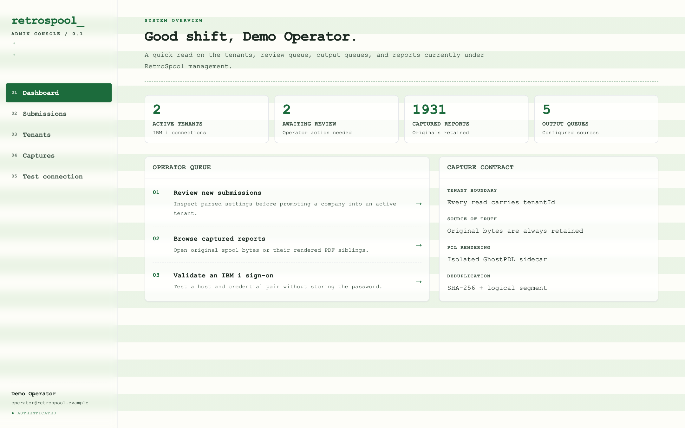
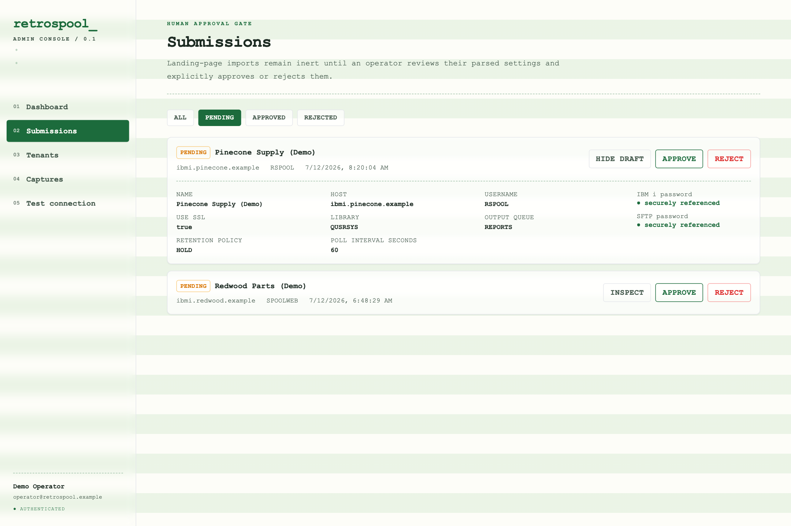
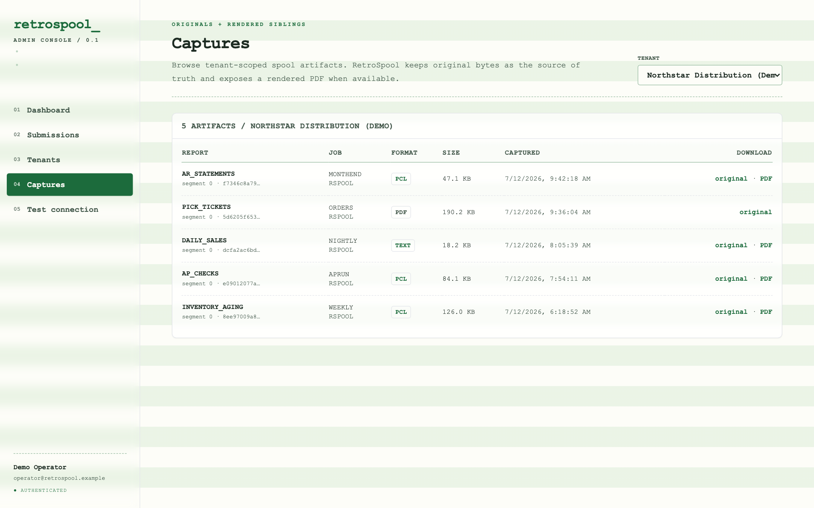
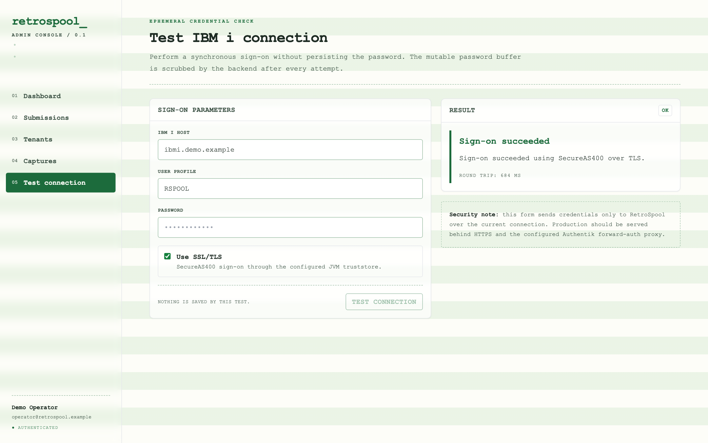

# retrospool


**Your AS/400 reports, as PDFs, over the web.** — [site](https://spillers-technology.github.io/RetroSpool/)

Retrospool captures spool files directly from IBM i (AS/400) output queues — no
printer-session emulation, no TN5250E, no Windows box running an ACS session — and
turns them into PDFs you can pull down or ship to S3 / SFTP / FTPS.

The old world: business reports land in an IBM i **output queue** (`OUTQ`), and a
laptop running a HOD-configured printer session "claims" a device to drain them.
Retrospool replaces that with a headless web service: the host queues spool files in
`*READY` whether or not any device is online, so the service just **polls the queue
via [JTOpen](https://github.com/IBM/JTOpen)**, reads the bytes, and takes it from there.

## Get started

```bash
mkdir retrospool && cd retrospool
curl -fsSLO https://raw.githubusercontent.com/Spillers-Technology/RetroSpool/v0.1.0/quickstart/docker-compose.yml
docker compose up -d
curl http://localhost:8080/api/health
```

That pulls the app from **[ghcr.io/spillers-technology/retrospool](https://github.com/Spillers-Technology/RetroSpool/pkgs/container/retrospool)**
and starts the full stack. Prefer a plain jar (bring your own Java 21)? Every
[release](https://github.com/Spillers-Technology/RetroSpool/releases) ships a zip with
a SHA-256 checksum. **[QUICKSTART.md](QUICKSTART.md)** walks through both paths.

Or, for those who like to live dangerously:

```bash
curl -fsSL https://raw.githubusercontent.com/Spillers-Technology/RetroSpool/main/quickstart/get.sh | bash
```

## What it does

```
IBM i OUTQ ─▶ poll (JTOpen) ─▶ sniff format ─▶ split concatenated PCL ─▶ store original
             [poller: planned]                                          └▶ render PCL→PDF
                                                                           (GhostPDL sidecar)
                                                    └▶ export fan-out: S3 / SFTP / FTPS
                                                       [planned]
```

The **middle band** — sniff → split → store → render → dedup, plus S3/MinIO landing
storage — is built and verified end-to-end. The authenticated **admin console** now
puts tenant, submission-review, capture, and connection-test workflows over that core.
The public HOD submission intake, **queue poller** that feeds the pipeline, and
**export fan-out** that drains it remain planned (see [Status](#status)).

## See it work

Retrospool now includes a React operator console for the authenticated admin surface:
dashboard counts, submission review and approval, tenant detail, tenant-scoped capture
downloads, and ephemeral IBM i connection tests. These views come from the real
production bundle through the repeatable
[`capture-product-media.mjs`](docs/scripts/capture-product-media.mjs) browser harness;
the `.example` hosts and report details are deterministic demo data.

| Operator dashboard | Submission approval gate |
|---|---|
|  |  |

| Tenant-scoped captures | Ephemeral Test Connection |
|---|---|
|  |  |

- **Format detection** — spool files are `DEVTYPE(*USERASCII)` opaque byte streams:
  PCL, PDF, plain text, or mystery bytes. Sniffed from the first 16 bytes.
- **PCL splitting** — concatenated reports are split on `ESC E` printer resets,
  guarded by a preceding form feed to dodge false positives inside binary sections.
- **PCL→PDF rendering** — via GhostPDL (`gpcl6`) running as an isolated sidecar
  container behind a tiny HTTP shim. The AGPL renderer never touches the JVM
  classpath (a Gradle `licenseGate` task enforces that on every build). The original
  `.pcl` is always kept alongside the rendered `.pdf`.
- **Text→PDF** — PDFBox, Courier, portrait/landscape auto-selected by line width.
- **Multi-tenant** — one tenant per company; every query is tenant-scoped, dedup is
  within-tenant only, and a reflection test gate fails the build if a repository
  query forgets its `tenantId`.
- **Idempotent capture** — `unique(tenant_id, sha256, segment_index)` makes restarts
  and re-polls safe by construction.
- **Operator console** — one authenticated workspace to review existing submissions,
  inspect tenant configuration and audit history, browse captures, and open original or
  rendered-PDF artifacts.
- **Authentik boundary** — production authentication terminates at an Authentik
  forward-auth outpost; Retrospool consumes the identity headers it injects (D-022).

## Stack

Spring Boot 3 / Java 21 (Temurin) · JTOpen · PostgreSQL 16 + Flyway · PDFBox ·
AWS SDK v2 (S3 landing store) · GhostPDL (sidecar container only) · Docker end-to-end
(the dev machine needs no JDK) · React 18 + Vite + TypeScript + TanStack Query +
Tailwind. The SFTP/FTPS libraries are declared, but the poller and export executors are
not yet wired — see Status.

## Admin authentication

In production, put Retrospool behind an **Authentik forward-auth outpost**. The outpost
authenticates the browser and injects `X-authentik-username`, `X-authentik-email`,
`X-authentik-name`, and `X-authentik-groups`; the app does not perform a second OIDC
redirect. Health probes and the low-trust `POST /api/connection/test` endpoint remain
anonymous; every admin API requires that identity and returns `401` without it. The
application service must not be reachable around the outpost, and the proxy must strip
any client-supplied identity headers before setting its own. Authentik policy is the
admin-authorization gate. Authenticated mutations also require Spring's cookie-backed
CSRF token (`XSRF-TOKEN` echoed as `X-XSRF-TOKEN`), while the server remains stateless
(D-022).

For local development only, start the jar with
`--retrospool.admin.dev-user=local-admin` to synthesize an operator identity when no
forwarded headers are present. Never enable that setting in production.

## Build it yourself

```bash
# local dependencies: Postgres 16, MinIO, and the PCL render sidecar
docker compose up -d

# build the SPA into Spring's static resources
docker run --rm -v "$PWD:/app" -w /app/frontend node:22-alpine \
  sh -c 'npm ci && npm run build'
mkdir -p src/main/resources/static
cp -R frontend/dist/. src/main/resources/static/

# build + unit tests + license gate (containerized Gradle)
docker run --rm -v "$PWD:/app" -w /app -v spool-gradle-cache:/home/gradle/.gradle \
  gradle:8.10.2-jdk21 gradle build --no-daemon

# run
java -jar build/libs/retrospool-0.1.0.jar
```

Integration tests (Testcontainers: real Postgres, MinIO, and the actual gpcl6
sidecar built from source) run via `gradle integrationTest` — see
[docs/decisions.md](docs/decisions.md) D-017 for the docker-in-docker invocation.

## Docs

Architecture, data model, the phased plan, and an append-only decision log live in
[docs/](docs/). Start with [docs/architecture.md](docs/architecture.md).

<a id="status"></a>

## Status

**v0.1.0 — pre-1.0.** Phases 0–3 are **complete and verified**. The v0.1.0 admin
slice is delivered; polling, export execution, and public submission intake remain on
the roadmap.

| Capability | State |
|---|---|
| JTOpen connection layer + Test Connection endpoint | **shipped** (mechanism wired & unit-tested; live signon awaits operator host/creds) |
| Persistence model (Flyway V1+V2, tenant-scoped repos, secrets, isolation gate) | **shipped** |
| Capture pipeline (sniff → split → store → PCL→PDF render → dedup) + S3 landing store | **shipped** (end-to-end tested vs real Postgres/MinIO/GhostPDL) |
| Authenticated admin APIs (identity/stats, submission review, tenants, captures/download) | **shipped** |
| React admin console (dashboard, review queue, tenants, captures, Test Connection) | **shipped** |
| Queue poller (scheduled `*READY` drain + watermark) | planned |
| Export destinations (S3 / SFTP / FTPS fan-out + retry) | planned |
| Public HOD `.ws` import + submission creation + destination/secret promotion | planned |
